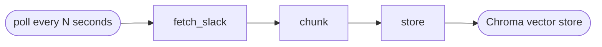
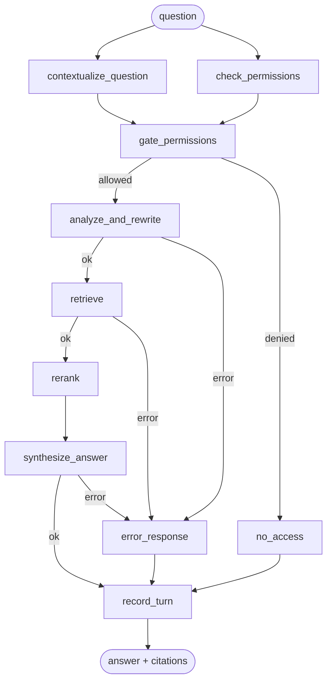

# Slack Knowledge Agent

A LangGraph-based agent that answers questions about a team's work by retrieving from its own Slack history — messages, threads, and pasted meeting transcripts — using Claude for reasoning and Voyage AI for embeddings and reranking.

Ask it in Slack:

> **@agent** what did Bob say about the API migration?
> **The migration is at 80% and expected to finish by Jan 21 2027** [1], according to Bob's message in #eng.

It cites its sources, remembers conversation context across follow-ups, refuses to answer with data a user doesn't have channel access to, and flags it when two sources genuinely disagree.

## Why this exists

Most "chat with your Slack" demos are a single retrieval call bolted onto an LLM. This is closer to what that actually takes in production: permission-aware retrieval (not just semantic search), a multi-step agent graph with real error handling and parallelism, per-user rate limiting, observability, and a deployment story — built incrementally, with each piece added because a real failure mode showed up, not speculatively.

## Architecture

Two separate LangGraph pipelines: one ingests, one answers.

### Ingestion pipeline



- **fetch_slack** — pulls new messages per channel since the last cursor, resolves user IDs to names, folds thread replies into their parent message, skips the bot's own replies (so it never cites its own past answers as a source).
- **chunk** — classifies each message's content shape (`chat` / `transcript` / `doc`) from the text itself and applies a splitter suited to it — a multi-speaker transcript gets larger chunks with turn-aware boundaries; a one-line greeting doesn't get split at all.
- **store** — embeds via Voyage AI and writes to Chroma, batched.

Edits and deletes are handled separately, in real time, by the Slack bot process (`message_changed` / `message_deleted` events trigger a targeted re-sync of just that thread) — not by the poller.

### Agent pipeline



- **contextualize_question** and **check_permissions** run in parallel — they don't depend on each other — and join before anything downstream, so permission denial can never race a follow-up resolution into running the expensive steps anyway.
- **check_permissions** looks up the asking user's *live* Slack channel membership and builds a mandatory allow-list filter. It's layered under every other retrieval filter, never optional, and fails closed — a lookup error means zero access, not full access.
- **analyze_and_rewrite** classifies intent (person/time/channel filters, whether the question needs a full transcript rather than top-k chunks) and generates search-query rewrites, in one call, on a smaller/faster model.
- **retrieve** runs the (possibly several) rewritten queries concurrently against Chroma, with the permission filter always applied.
- **rerank** uses a dedicated Voyage rerank model instead of asking an LLM to score relevance — materially cheaper and faster.
- **synthesize_answer** answers using only the retrieved excerpts, cites inline, and checks the same excerpts for genuine disagreement in the same call.
- Every node that calls an external API degrades gracefully or routes to a generic error response — nothing raises a stack trace back to the user.

## What's actually interesting here

- **Permission-aware retrieval.** The hard part of RAG over private company data: a user can only ever be shown content from channels they currently belong to, checked live against Slack, not cached-forever.
- **Content-aware chunking.** Chat messages, meeting transcripts, and long-form docs get different chunk sizes and split strategies, decided from the text shape itself.
- **Real parallelism, verified, not assumed.** The graph's parallel branches were tested against a minimal LangGraph reproduction before being trusted — LangGraph triggers a node on *any* incoming edge firing, not "all declared edges," which is a real footgun for naive fan-out/fan-in.
- **A stale-state bug found by writing a failing test first.** A per-turn `error` flag was never cleared between turns on the same conversation thread, so one earlier failure could silently hijack routing on every later turn — reproduced with a real checkpointer before being fixed, not just patched on a hunch.
- **Cost control that isn't hand-waved.** Per-user burst + daily rate limits, model right-sizing (Haiku for classification, Opus for synthesis), a dedicated reranker instead of an LLM call, and dashboards/alerts on actual token spend.
- **Prompts as data.** Every LLM-facing prompt lives in `prompts/*.txt`, loaded and formatted at runtime — not buried in f-strings — verified byte-for-byte identical to the original inline versions during the refactor.

## Tech stack

LangGraph · Claude (Opus 5 for synthesis, Haiku 4.5 for classification) · Voyage AI (embeddings + reranking) · Chroma · Slack Bolt (Socket Mode) · Prometheus + Grafana · Docker · Kubernetes

## Project structure

```
src/
├── config.py, vectorstore.py   # foundational, shared by everything
├── slack/                      # Slack-API-specific code
│   ├── ingest.py, sync.py, bot.py, access_control.py
├── ingestion/                  # fetch -> chunk -> store pipeline
│   ├── graph.py, chunking.py, state.py
├── agent/                      # the question-answering graph
│   ├── qa_graph.py, reranker.py, prompts.py
└── infra/                      # metrics, health checks, rate limiting
    ├── metrics.py, health.py, rate_limiter.py

prompts/            # the actual prompt text, as plain .txt templates
k8s/                 # Kubernetes manifests (Deployment, PVCs, ServiceMonitor, alerts)
observability/       # Grafana dashboard JSON
main.py              # one-shot ingestion run
ask.py               # CLI to test the agent without Slack
slack_bot.py          # long-running Slack bot (Socket Mode)
ingest_worker.py      # long-running ingestion poller
```

## Running it

1. **Slack app**: create one at [api.slack.com/apps](https://api.slack.com/apps). Grant bot scopes `channels:history`, `channels:read`, `groups:history`, `groups:read`, `users:read`, `im:history`, `mpim:history`, `im:read`, `app_mentions:read`, `chat:write`, `reactions:write`. Enable Socket Mode and create an app-level token (`connections:write`). Add event subscriptions: `app_mention`, `message.im`, `message.channels`, `message.groups`. Invite the bot to the channels you want ingested.
2. **Keys**: a [Voyage AI](https://dash.voyageai.com) key (embeddings + reranking) and an [Anthropic](https://console.anthropic.com) key.
3. Copy `.env.example` to `.env` and fill in the values above.
4. `pip install -r requirements.txt`
5. Run it:
   - `python main.py` — one-shot ingestion
   - `python ingest_worker.py` — keeps ingesting automatically (run alongside the bot)
   - `python slack_bot.py` — the live bot
   - `python ask.py --user <slack_user_id> "question"` — test from the CLI without Slack, or omit the question for an interactive multi-turn session

## Deployment & observability

`Dockerfile` + `docker-compose.yml` for local containerized runs; `k8s/` has manifests for a real cluster deployment (health probes, a `Recreate` strategy sized for the current single-node storage model, ServiceMonitor + PrometheusRule for scraping and alerting). `observability/grafana-dashboard.json` is an importable dashboard covering latency, error rate, retrieval quality proxies, and estimated spend.

## Status / known limitations

- Single Slack workspace per deployment (multi-tenant by config, not by a shared multi-workspace OAuth install flow).
- Local Chroma + SQLite means the current Kubernetes deployment is single-replica by design, not horizontally scaled — documented in `k8s/deployment.yaml`.
